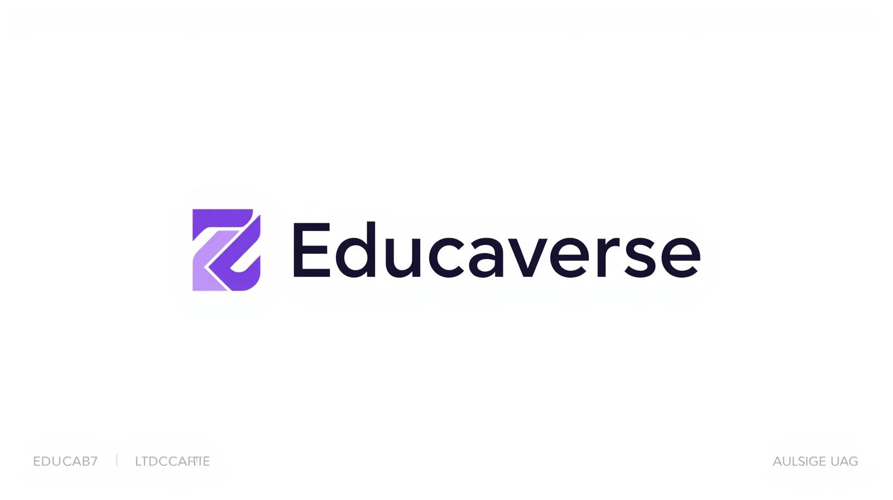

# Perfil Profissional

## 🪪 Dados pessoais:
* Nome: Gabriel Vilela Zamberlan

* Idade: 16 anos 

* Cidade: Presidente Prudente,SP

* Email: gabriel.zamberlan@aluno.senai.br

* CPF: 756.231.456-78

* GitHub: github.com/GabrielZamberlan11

## 🎖 Objetivo:
* Atuar como um profissional na área de TI, como principal objetivo tenho em mente a area de programador.

## 🗣 Línguas:
* Português: Nativo
* Inglês: Basico

## 🧑‍🎓 Certificados:
*    

*  

* Certificação no curso de fundamentos em python da Cisco

* Certificado_FLUÊNCIA - FUNDAMENTOS DA INTELIGÊNCIA ARTIFICIA

* Certificado_Ética na Inteligência Artificia

## 🧠 Conhecimentos:
* Conhecimento sobre python e suas bibliotecas.

* Realização das materias de Sistemas Operacionais, Levantamento de requisitos, Logica de Programação, Arquitetura de Redes com IOT no senai.

* Pratica com computação em nuvem pela AWS e aprendendo sobre os conceitos da Azure.

* Participando do processo da SpSkills na area de computação em nuvem.

## 💪 Pontos Fortes:
* Proativo
* Rapida adaptação em tecnologias novas
* Bom com resolução de problemas
* Bom com trabalho em equipe

## 😓 Pontos a melhorar:
* Melhorar a comunicação
* Melhorar minha liderança
* Emocionalmente sensivel

## 📈 Metas de curto prazo(1 ano ou menos)
* Participar do estadual da Spskills e passar para o nacional.
* Realizar mais cursos da AWS.
* Melhorar o meu ingles.

## 🔝 Metas a longo prazo
* Estar consolidado em um emprego na área de TI.
* Ficar fluente em inglês

## 🕹 Hobbies
* Fazer automações tecnologicas em jogos diversos 
* Assistir filmes e series
* Fazer academia
* Escutar diversas músicas 

## 🖥Wireframes

 